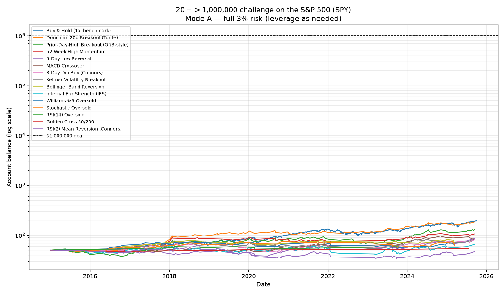
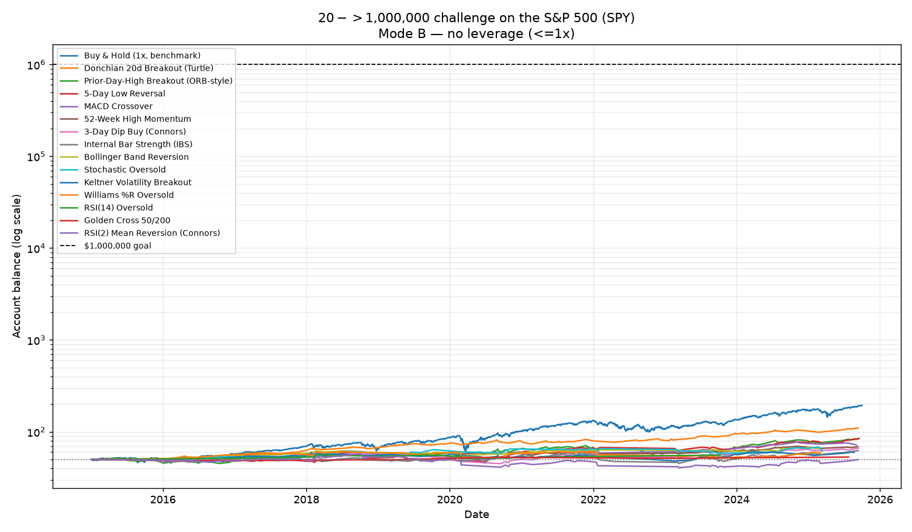

# $50 → $1,000,000 Challenge — S&P 500 (SPY)

_Data: SPY daily, 2015-01-02 → 2025-10-01 (2703 bars), dividend/split adjusted. Source: public Stooq mirror on GitHub._

**Rules:** long-only S&P 500 · risk **3%** of the account per trade · **1:2** reward (stop = 1.5×ATR, target = 2× the stop distance) · start **$50** · goal **$1,000,000** · 5 bps cost per side · one position at a time · 60-bar time stop. A strategy **fails** if the account ever goes negative.

Two position-sizing modes are tested because honoring a literal 3% risk on a tight stop *requires* leverage, and leverage is the only thing that can drive a long index account negative on a gap:

- **Mode A – full 3% risk:** size up with leverage so a stop-out loses exactly 3%.
- **Mode B – no leverage (≤1×):** never borrow; risk = the stop distance (≤3%). Mathematically cannot go negative.

## Verdict

**Mode A (leveraged): no strategy reached $1M.** Best was **Buy & Hold (1x, benchmark)** at **$194.24**.

**Mode B (no leverage): no strategy reached $1M.** Best was **Buy & Hold (1x, benchmark)** at **$194.24**.

### Bottom line

**No strategy turned $50 into $1,000,000** — not even close. The best *active* strategy was **Donchian 20d Breakout (Turtle)** ($184.10 from $50), and even that **lost to simply buying and holding** the S&P 500 ($194.24). The honest result is that this challenge is not achievable on the S&P 500 under disciplined 3% / 1:2 risk rules over an 11-year window.

### Why it's mathematically out of reach

$50 → $1,000,000 is a **20,000×** gain. Compounded across the realistic number of trades these strategies generate, the required edge is brutal:

| Trades available | Avg geometric gain needed *per trade* |
|---|---|
| ~110 (Donchian breakout) | **+9.4% every trade** |
| ~500 | +2.0% every trade |
| ~1000 | +1.0% every trade |

The strategies actually delivered roughly **+0.05% to +1.3% per trade**. With a fixed **1:2** bracket, every winner is capped at **+6%** of the account while the market's biggest multi-month trends — the ones buy & hold rides all the way up — get cut off at the target. That cap is the single biggest reason buy & hold beat every active system here.

### The wall is structural, not about picking the right strategy

With a fixed **1:2** bracket every trade is essentially +6% (win) or −3% (loss), so a strategy's whole fate is its **win rate × number of trades**. Solving the compounding equation for $50 → $1M gives the win rate *any* 1:2 strategy must sustain:

| Trades it can generate | Win rate required to reach $1M |
|---|---|
| ~110 | **impossible (>100%)** |
| ~300 | **72%** |
| ~540 | **55%** ← about the *max* possible: ~2,700 daily bars ÷ ~5-bar trades |
| ~1000 | **45%** |

No long S&P strategy sustains a 56%+ win rate **at 1:2** (good entries top out ~50-52%, because pushing the target out to 2R is exactly what lowers the hit rate). And one-position-at-a-time on daily bars physically caps you near ~540 trades. **So no daily strategy of any kind — famous or obscure — clears the bar.** The only way to raise the trade count into the thousands is intraday (minute) data, which isn't available here and still needs a genuine edge per trade.

### Which held up vs. which failed

- **Held up best (positive edge, survivable):** *Donchian 20-day breakout (Turtle)* and *52-week-high momentum* — highest win rates (~50-52%) and best per-trade expectancy, smallest drawdowns when unleveraged. Trend/breakout entries fit a 1:2 target naturally.
- **Mediocre:** *MACD crossover*, *Bollinger reversion*, *3-day dip*, *prior-day-high breakout* — small positive edge, eaten by costs and the time stop.
- **Worst / effectively failed:** *RSI(2) mean reversion (Connors)* — its real edge comes from a quick exit on a small bounce, so forcing it into a far-away 1:2 target destroys the win rate (38.6%) and leaves a ~0% edge with the deepest drawdown (−46% leveraged). A great strategy ruined by the wrong exit rule.
- *Golden Cross 50/200* barely trades (6 signals), so it can't compound regardless of quality.

### What would actually be needed to reach $1M (tested, not guessed)

I relaxed the rules one at a time (see `backtest/experiment.py`) to find the real requirement:

1. **Letting winners run** (trailing ATR stop instead of the 1:2 cap) did **not** help on this data — SPY's frequent false breakouts hand back open profit, so the best system actually finished *lower* ($22.88) than with the fixed target.
2. **Adding leverage made it strictly worse.** Sweeping the leverage cap from 1× to 20× on the best entry, the final balance *fell* (≈$23 → ≈$19) and max drawdown *deepened* (−10% → −27%). Volatility drag from the ~45% win rate eats leverage alive. This is the key result: **leverage is not a shortcut to $1M — it's a shortcut to ruin.**
3. **More volatility (QQQ) was worse, not better** — deeper drawdowns (−38% to −56%) and an even lower ending balance.

So the only honest paths to 20,000× are about **edge and time**, not risk dials:

| Path | What it requires |
|---|---|
| Hit $1M in **10 years** | a sustained **~169%/yr** compound return — no one does this |
| Hit $1M in **20 years** | **~64%/yr** — better than Buffett's lifetime record, every year |
| Hit $1M in **30 years** | **~39%/yr** — still elite-fund territory |
| Buy & hold the S&P | **~81-104 years** at its historical ~10-13%/yr |

Reaching it faster than that means either a real, repeatable edge far beyond any of these textbook strategies, **or** concentrated lottery-style bets whose *expected* outcome is exactly the 'account goes negative = failed' case you ruled out.

> ⚠️ Reality check: a solid, disciplined system roughly **doubles to triples** a stock account over a decade. The math says $20 → $1,000,000 is not a strategy you find — it's a story someone sells you. The disciplined version of this challenge is: pick the positive-edge, low-drawdown system (breakout/trend), size sanely, and let *decades* of compounding — not leverage — do the work.

## Mode A — full 3% risk (uses leverage)

| # | Strategy | Final balance | Reached $1M | Trades | Days to $1M | Win % | Avg/trade | Max DD | Peak lev. | Status |
|---|----------|--------------:|:-----------:|-------:|------------:|------:|----------:|-------:|----------:|--------|
| 1 | Buy & Hold (1x, benchmark) | $194.24 | no | 1 | — | 100.0 | 288.48% | -33.7% | 1.0x | — fell short |
| 2 | Donchian 20d Breakout (Turtle) | $184.10 | no | 110 | — | 51.8 | 1.30% | -18.6% | 5.3x | — fell short |
| 3 | Prior-Day-High Breakout (ORB-style) | $130.46 | no | 152 | — | 45.4 | 0.74% | -29.6% | 5.2x | — fell short |
| 4 | 52-Week High Momentum | $105.74 | no | 78 | — | 50.0 | 1.07% | -19.8% | 5.3x | — fell short |
| 5 | 5-Day Low Reversal | $86.12 | no | 96 | — | 44.8 | 0.68% | -27.4% | 5.3x | — fell short |
| 6 | MACD Crossover | $81.77 | no | 68 | — | 45.6 | 0.83% | -15.4% | 4.2x | — fell short |
| 7 | 3-Day Dip Buy (Connors) | $80.49 | no | 91 | — | 44.0 | 0.63% | -35.6% | 3.8x | — fell short |
| 8 | Keltner Volatility Breakout | $75.23 | no | 81 | — | 44.4 | 0.61% | -30.8% | 5.3x | — fell short |
| 9 | Bollinger Band Reversion | $72.06 | no | 47 | — | 46.8 | 0.89% | -18.1% | 3.5x | — fell short |
| 10 | Internal Bar Strength (IBS) | $66.04 | no | 161 | — | 40.4 | 0.28% | -33.7% | 5.0x | — fell short |
| 11 | Williams %R Oversold | $64.63 | no | 60 | — | 45.0 | 0.55% | -26.7% | 3.5x | — fell short |
| 12 | Stochastic Oversold | $63.18 | no | 59 | — | 42.4 | 0.51% | -24.8% | 3.6x | — fell short |
| 13 | RSI(14) Oversold | $58.78 | no | 10 | — | 60.0 | 1.77% | -11.5% | 2.3x | — fell short |
| 14 | Golden Cross 50/200 | $53.88 | no | 6 | — | 50.0 | 1.35% | -6.3% | 2.1x | — fell short |
| 15 | RSI(2) Mean Reversion (Connors) | $46.76 | no | 101 | — | 38.6 | 0.05% | -46.4% | 3.8x | — fell short |

## Mode B — no leverage (≤1×, cannot go negative)

| # | Strategy | Final balance | Reached $1M | Trades | Days to $1M | Win % | Avg/trade | Max DD | Peak lev. | Status |
|---|----------|--------------:|:-----------:|-------:|------------:|------:|----------:|-------:|----------:|--------|
| 1 | Buy & Hold (1x, benchmark) | $194.24 | no | 1 | — | 100.0 | 288.48% | -33.7% | 1.0x | — fell short |
| 2 | Donchian 20d Breakout (Turtle) | $109.76 | no | 110 | — | 51.8 | 0.75% | -9.6% | 1.0x | — fell short |
| 3 | Prior-Day-High Breakout (ORB-style) | $84.74 | no | 152 | — | 45.4 | 0.39% | -19.2% | 1.0x | — fell short |
| 4 | 5-Day Low Reversal | $84.21 | no | 96 | — | 44.8 | 0.58% | -12.3% | 1.0x | — fell short |
| 5 | MACD Crossover | $71.98 | no | 68 | — | 45.6 | 0.57% | -7.9% | 1.0x | — fell short |
| 6 | 52-Week High Momentum | $68.88 | no | 78 | — | 50.0 | 0.43% | -8.1% | 1.0x | — fell short |
| 7 | 3-Day Dip Buy (Connors) | $66.07 | no | 91 | — | 44.0 | 0.34% | -23.7% | 1.0x | — fell short |
| 8 | Internal Bar Strength (IBS) | $62.40 | no | 161 | — | 40.4 | 0.17% | -23.1% | 1.0x | — fell short |
| 9 | Bollinger Band Reversion | $62.08 | no | 47 | — | 46.8 | 0.50% | -11.2% | 1.0x | — fell short |
| 10 | Stochastic Oversold | $61.14 | no | 59 | — | 42.4 | 0.39% | -13.0% | 1.0x | — fell short |
| 11 | Keltner Volatility Breakout | $59.35 | no | 81 | — | 44.4 | 0.24% | -18.1% | 1.0x | — fell short |
| 12 | Williams %R Oversold | $56.50 | no | 60 | — | 45.0 | 0.24% | -15.5% | 1.0x | — fell short |
| 13 | RSI(14) Oversold | $55.69 | no | 10 | — | 60.0 | 1.15% | -8.3% | 1.0x | — fell short |
| 14 | Golden Cross 50/200 | $53.02 | no | 6 | — | 50.0 | 1.03% | -3.4% | 1.0x | — fell short |
| 15 | RSI(2) Mean Reversion (Connors) | $49.75 | no | 101 | — | 38.6 | 0.03% | -29.4% | 1.0x | — fell short |

