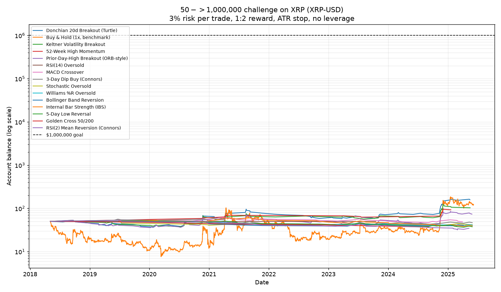

# $50 → $1,000,000 Challenge — XRP (crypto)

_Data: XRP daily, 2018-05-04 → 2025-06-07 (2592 bars). Source: public Binance XRPUSDT mirror on GitHub (≈ Coinbase XRP-USD). Price ranged $0.135–$3.292._

**Rules:** long-only · risk 3% per trade · 1:2 reward (1.5×ATR stop) · start $50 · goal $1,000,000 · 5 bps/side cost · one position at a time · 60-bar time stop.

### Verdict

**No strategy reached $1M.** Best was **Donchian 20d Breakout (Turtle)** at **$157.84** from $50, which *beat buy & hold* ($122.31) — and did so with far less pain (max DD -40% vs buy & hold's -85%).

**Notable:** XRP is so volatile that risking just 3% forces a **sub-1× position** (peak ~0.6×), so leverage is never used and **the account cannot go negative** — your hard rule is satisfied automatically. The blocker is still the 1:2 cap + ~45% win rate × ~120 trades, the same structural wall as the S&P.

| # | Strategy | Final | Reached $1M | Trades | Win % | Max DD | Peak lev |
|---|----------|------:|:-----------:|-------:|------:|-------:|---------:|
| 1 | Donchian 20d Breakout (Turtle) | $157.84 | no | 119 | 45 | -40% | 0.6x |
| 2 | Buy & Hold (1x, benchmark) | $122.31 | no | 1 | 100 | -85% | 1.0x |
| 3 | Keltner Volatility Breakout | $103.04 | no | 87 | 43 | -29% | 0.6x |
| 4 | 52-Week High Momentum | $92.59 | no | 21 | 62 | -12% | 0.4x |
| 5 | Prior-Day-High Breakout (ORB-style) | $73.60 | no | 138 | 38 | -41% | 0.6x |
| 6 | RSI(14) Oversold | $49.65 | no | 1 | 0 | -1% | 0.2x |
| 7 | MACD Crossover | $48.79 | no | 28 | 36 | -23% | 0.6x |
| 8 | 3-Day Dip Buy (Connors) | $46.61 | no | 37 | 32 | -27% | 0.5x |
| 9 | Stochastic Oversold | $41.77 | no | 25 | 28 | -21% | 0.4x |
| 10 | Williams %R Oversold | $40.97 | no | 16 | 19 | -20% | 0.4x |
| 11 | Bollinger Band Reversion | $40.51 | no | 17 | 24 | -22% | 0.4x |
| 12 | Internal Bar Strength (IBS) | $39.43 | no | 44 | 27 | -37% | 0.5x |
| 13 | 5-Day Low Reversal | $37.57 | no | 31 | 26 | -31% | 0.6x |
| 14 | Golden Cross 50/200 | $36.76 | no | 10 | 0 | -26% | 0.4x |
| 15 | RSI(2) Mean Reversion (Connors) | $34.67 | no | 35 | 23 | -40% | 0.4x |

